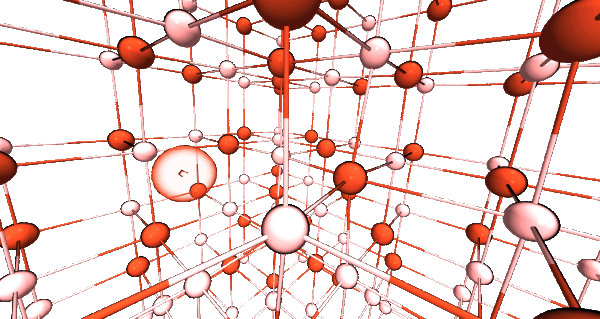

# Smooth Trajectory

## Script to smooth xyz and cube file trajectories. Applies spline interpolation to the trajectory

Interpolate between images in a trajectory.  

Works with .xyz and .cube files. 

Pass the files as arguments in the order in which they appear in the trajectory. 

The default is to interpolate so that the trajectory becomes 10 images. This behaviour can be controlled by command line options.

Command line option required to interpolate cube data

Minimum of 3 files required as input to be able to interpolate!

positional arguments:
-  Files                 Files used in program

optional arguments:
-  -h, --help            show this help message and exit
-  -c, --cube            Interpolate cube data. May take a few minutes.
-  -n NINTERP, --ninterp NINTERP  Total number of images to interpolate to. This includes the files that are passed as arguments

usage: smooth_trajectory.py [-h] [-c] [-n NINTERP] Files [Files ...]

     
